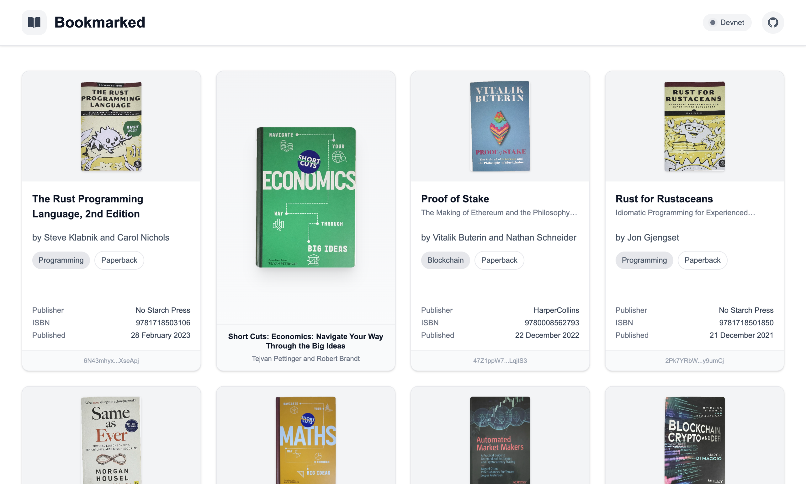
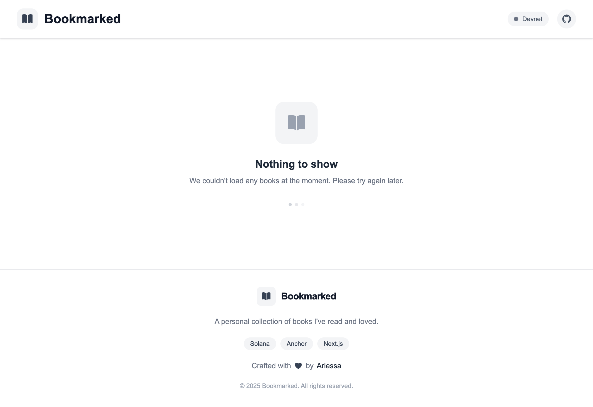

# Project Description

**Deployed Frontend URL:** [https://bookmarked-ari.vercel.app](https://bookmarked-ari.vercel.app)

**Solana Program ID:** [EAdTq2R8jDTwFYCkYq2hm1v9webRddR3QWkLpBr31brp](https://solscan.io/account/EAdTq2R8jDTwFYCkYq2hm1v9webRddR3QWkLpBr31brp?cluster=devnet)

<br />

## Project Overview

### Description

Bookmarked is an app to view a curated collection of books on Solana. The frontend provides a browsable grid of stored books and read-only access to on-chain data.

The on-chain program (book) stores book metadata (title, author, isbn, publisher, image, format, genre, publication date) and uses a single administrative config account to control creation, updates and closing of book accounts.

<br />

### Key Features

- Admin-controlled creation, update and closing of book entries (on-chain)
- Read-only frontend listing books from the program (no wallet connection from the frontend)
- Tests covering happy and unhappy flows for all instructions

<br />

### How to Use the frontend (read-only)

- The frontend is a read-only UI that fetches and displays books from the deployed Solana program.
- There is no wallet connect or mutation UI in the frontend; all create/update/delete operations are performed on-chain via deploy script.

### Home Page





<br />

### Not Found Page


<br />

## Program Architecture

The program uses PDAs for deterministic accounts:

### PDA Usage

- Config PDA
  - Seed: `["config"]`
  - Purpose: store admin public key and bump for program-level authority
- Book PDA
  - Seed: `["book", isbn.as_bytes()]`
  - Purpose: per-book account storing metadata; isbn is used as unique identifier so book PDA is deterministic by ISBN

### Program Instructions

- initialize_config()
  - Creates the config PDA and sets `admin = signer`
  - Must be called once by the desired admin
- create*book(title, author, isbn, image, publisher, publication_date, format*, genre)
  - Admin-only. Creates the book PDA for the provided ISBN and stores metadata.
  - Validates lengths (e.g. title <= MAX_TITLE) and stores bump + created_at
- update_genre(genre)
  - Admin-only. Updates the genre field of an existing book (book PDA must be provided)
- update_image(image)
  - Admin-only. Updates the image URL of an existing book (book PDA must be provided).
  - Validates length (e.g. image <= MAX_IMAGE) and stores the new image string.
- close_book()
  - Admin-only. Closes the book account and transfers lamports to admin (close = authority in account attrs)

<br />

## Account Structure

```rust
#[account]
pub struct Config {
    pub admin: Pubkey,
    pub bump: u8,
}

#[account]
pub struct Book {
    pub title: String,
    pub author: String,
    pub isbn: String,
    pub image: String,
    pub publisher: String,
    pub publication_date: i64,
    pub format_: String,
    pub genre: String,
    pub created_at: i64,
    pub bump: u8,
}
```

Important notes:

- The admin is stored in the Config account and is the canonical owner.
- Constants such as `MAX_TITLE` are defined in Rust and mirrored in tests (see Testing).

<br />

## Unit tests (coverage)

Tests live at: `anchor-project/tests/book.ts`. Current coverage:

- initialize_config

  - happy: create config PDA and set admin to signer
  - unhappy: cannot initialize twice (account already in use)

- create_book

  - happy: admin can create a book with full metadata
  - unhappy: title > MAX_TITLE triggers `TitleTooLong`
  - unhappy: non-admin signer rejected (`UnauthorizedCreator`)
  - assertions: stored fields (title, isbn, format\_/format, genre)

- update_genre

  - happy: admin can update a book's genre (change persisted)
  - unhappy: non-admin signer rejected (`Unauthorized`)

- update_image

  - happy: admin can update a book's image URL (stored and fetchable)
  - unhappy: non-admin/non-owner signer rejected (`Unauthorized`)
  - unhappy: image length > MAX_IMAGE triggers `ImageTooLong`
  - assertions: image field updated; other fields unchanged

- close_book
  - happy: admin can close (delete) a book; account becomes non-fetchable
  - unhappy: non-admin cannot close (assert error `Unauthorized` or message contains "unauthorized"/"owner")

Notes:

- Boundary tests (exact MAX lengths) and additional field-length errors can be added following the same patterns.
- Mirrored constants: tests define TEST_MAX_TITLE = 200 to match Rust's `MAX_TITLE`.

<br />

## Testing

Run tests

```bash
anchor build && anchor test
```

<br />

## Deployment

1. Set Solana CLI to devnet and ensure deploy keypair.

   ```bash
   solana config set --url https://api.devnet.solana.com
   ```

2. Airdrop SOL to deployer.

   ```bash
   solana airdrop 2 $(solana address) --url https://api.devnet.solana.com
   ```

3. Update `Anchor.toml`'s `programs.devnet` entry and `declare_id!()` in Rust to the program id.
4. Build and deploy with Anchor.

   ```bash
   anchor build
   anchor deploy --provider.cluster devnet
   ```

<br />

### Add books script

A convenience script to populate book date is included at `anchor-project/migrations/add_books.ts`.

<br />

## Additional Notes

- The frontend is intentionally read-only; admin workflows are done off-frontend using a script.
- List of books can be found at `anchor-project/migrations/books.json`.
- All book cover images were taken by me and uploaded in the GitHub issues section of the [Bookmarked](https://github.com/ariessa/bookmarked) repository.
